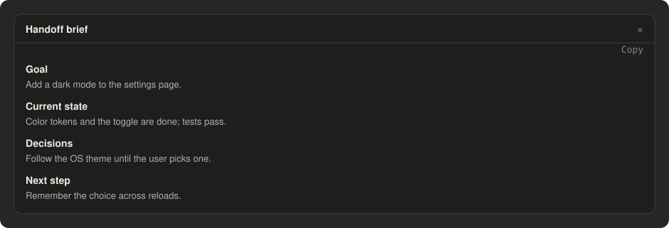

# claude-mods

**AI Tools** is a mod for [Claude Code](https://claude.com/claude-code) that adds one slim ribbon above the prompt.
At a glance it shows how much of your Claude subscription you have used, how full the conversation is, and what the
work would have cost at API prices. Behind two small buttons it adds a live checklist of Claude's plan, a panel for
watching subagents, a panel for tidying up worktrees, and a one-click handoff to a fresh session. In the desktop app, Clawd, Claude Code's pixel mascot,
stands at the start of the bar acting out what Claude is doing.

It works in the **Code tab of the Claude desktop app** and in the **`claude` terminal app**.



## What it does

### Usage and cost at a glance

The bar reads left to right. Labels are dim, values brighter; usage and context turn **yellow at 70%** and **red at
90%**, so you notice before you hit a limit.

| You see | What it means |
|---|---|
| `5h 42%, 1h12m` | You have used 42% of your 5-hour allowance; it resets in 1 hour 12 minutes |
| `wk 74%, Thu` | You have used 74% of your weekly allowance; it resets Thursday |
| `ctx 31% 62k/200k` | How full this conversation's memory (context window) is |
| `tok 1.3M (+48k)` | Tokens this conversation has used this month, and in the last turn |
| `cache 42m` | How long Claude's prompt cache stays warm (a cold cache makes the next message cost more) |
| `thread $3.12 (+$0.41)` | What this conversation, and its last turn, would cost at API prices |
| `~2.1% wk` | Roughly how much of your weekly allowance this conversation has taken |
| `month $184.20` | All your Claude Code use this month on this computer, at API prices |
| `limit ~3:40pm` | At your current pace, when you would run out of the 5-hour allowance |

Dollar figures are what the same work would cost through Anthropic's API, not what you pay for a subscription. They
are a handy way to see which conversations are expensive.

### Two buttons: tools and display options

**🛠** opens a row of tools above the bar. **⁝** opens the display options, where you can switch any part of the bar
on or off; the choices are saved. Anything switched off also stops doing work in the background. In the terminal the
two buttons read `tools` and `opts`.



### Task View and Clean View

Turn on **Task View** from the 🛠 row and, for any request that takes real work, Claude lays out its plan as a
checklist under the bar and ticks steps off as it goes, with a progress bar on each. When it finishes, the list folds
to a single `✓ Done` line.

**Clean View** does the same and also hides the stream of tool calls and work-in-progress text, leaving just the
checklist and Claude's final answer. Pick whichever view you like; picking it again turns it off.



### Subagents

For bigger jobs Claude can hand pieces to subagents, helpers that work at the same time. The **Subagents** pane lists
each one with what it is doing, how far along it is and how long it has run, and Clawd gets a mini Clawd stacked on his
head for every helper at work.

The pane can also set a **team size** (3 to 30 helpers at once) and ask Claude to split work across the team, and can
run helpers on a faster, cheaper model. Leave it on **Default** to just watch.



### Worktrees

Worktrees from finished sessions pile up. The **Worktrees** pane lists every worktree of the project, the main checkout
first, each with what it still holds (changed files, unpushed commits, merged, its pull request), how old it is, lines
added and removed, whether CI passed, and a × to delete it.

**Clean worktrees** removes every worktree that is merged and has nothing uncommitted, with its local and remote
branch, after asking first. Anything with work in it stays. Clawd prunes a tree beside the list, sweeps up while
worktrees are removed, and naps when there are none. The pane only reads git while it is open.



### Handoff

**Handoff** asks Claude for a short brief of the conversation: the goal, where things stand, decisions made, and the
next step. Copy it and paste it into a new session to pick up where you left off, with a fresh, empty context. Type
`/handoff` to get the same brief in the chat, copied to your clipboard.



### Commands

| Type | To |
|---|---|
| `/aitools` | Hide or show the whole bar (`/aitools on`, `/aitools off`) |
| `/handoff` | Write a handoff brief into the chat and copy it |
| `/taskview`, `/cleanview` | Turn Task View or Clean View on or off |
| `/subagents` | Open or close the Subagents pane |
| `/worktrees` | Open or close the Worktrees pane |

The full reference for every option is in the [mod's own README](plugins/aitools/README.md).

## Install

**From a terminal** (works for both the desktop app and the terminal app, since they share one setup). Open a
terminal (Terminal on macOS, PowerShell on Windows) and run these two commands:

```bash
claude plugin marketplace add pkkid/claude-mods
claude plugin install aitools@claude-mods
```

The first tells Claude Code where to find the mod; the second installs it. If the `claude` command is not found,
install Claude Code first by following [its setup guide](https://claude.com/claude-code).

**Or from inside a Claude Code terminal session**, type the same two steps at the prompt:

```
/plugin marketplace add pkkid/claude-mods
/plugin install aitools@claude-mods
```

**Then start a new session.** The bar appears above the prompt. In the desktop app the mod is listed under
**+ › Plugins › Manage plugins** next to the prompt box.

## Turn it off, update, or remove it

- **Hide the bar** for a while: type `/aitools off` (and `/aitools on` to bring it back). The choice is remembered.
- **Hide parts of it**: press **⁝** and switch off what you don't need.
- **Get the latest version**:

  ```bash
  claude plugin marketplace update claude-mods
  claude plugin update aitools@claude-mods
  ```

- **Remove it**:

  ```bash
  claude plugin uninstall aitools@claude-mods
  ```

  In a terminal session you can also do all of this from the menu that `/plugin` opens, under **Installed**.

## Develop

Want to help build the mod or add a new one? See [DEVELOP.md](DEVELOP.md).
